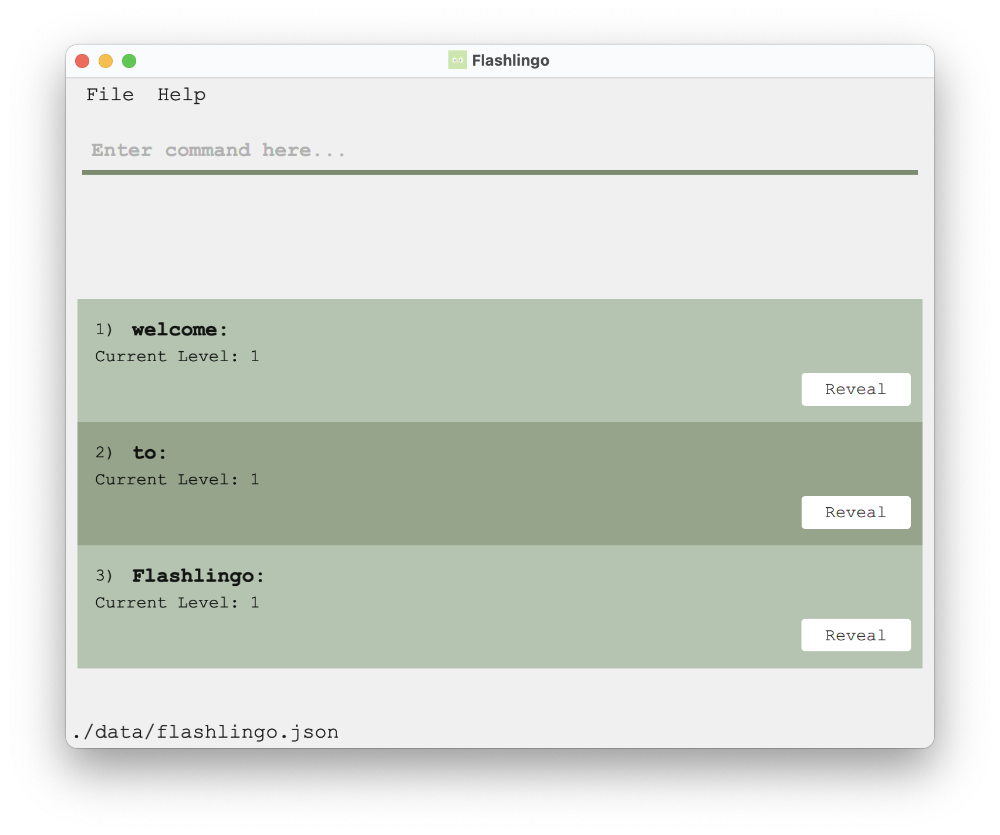

* This is **a vocabulary memorizing project for all language learners**. 
* This project is designed to assist language learners in memorizing words efficiently using a scientific approach based on the **Ebbinghaus Forgetting Curve**.
  * The app provides a  command-line interface (CLI) for users to interact with.
  * It schedules word revision sessions at specific times to maximize word retention.
* The project is based on a software project for a desktop application (called _AddressBook_) used for managing contact details.
  * It is **written in OOP fashion**. It provides a **reasonably well-written** code base **bigger** (around 6 KLoC) than what students usually write in beginner-level SE modules, without being overwhelmingly big.
  * It comes with a **reasonable level of user and developer documentation**.
* It is named `Flashlingo` because it was initially inspired by **flashcards** and **duolingo**.
* For the detailed documentation of this project, see the **[Flashlingo Product Website](https://ay2324s1-cs2103t-t11-4.github.io/tp/)**.

## Acknowledgments
This project is based on the AddressBook-Level3 project created by the [SE-EDU initiative](https://se-education.org).
